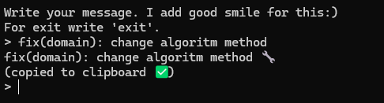

# 😄 smile-your-commits
[](https://github.com/oleg-murmur/smile-your-commits/actions/workflows/test.yml)

> Add emotion to your commits with automatic emoji tagging based on keywords.

---

## ✨ What is this?

`smile-your-commits` is a cross-platform CLI tool written in Go that adds emojis to your text based on keywords.  
Perfect for automating and decorating your commit messages.

```bash
Input:    fix[JIRA-123] add need api autotest
Output:   🛠️ 🧪 fix[JIRA-123] add need api autotest
```


---

## 🟢 Prebuilt Binaries

You can download prebuilt binaries for Windows, Linux, and macOS from the following link:

[Download binaries](https://github.com/oleg-murmur/smile-your-commits/releases/tag/1.0.0)

These binaries allow you to run the program without building it from source.


## ⚙️ Installation

### Windows / Linux / macOS

Download binaries from [release](#) or build manually:

```bash
bash bin/build.sh
```

Binaries (`.exe` and others) will appear in the `./build` folder.

---

### 🐧 Additional for Linux

Install dependencies needed for Go GUI and TUI libraries (if used):

```bash
sudo apt update
sudo apt install libgl1-mesa-dev xorg-dev libxi-dev
```

---

## 📁 Configuration

Example `config.json`:

```json
{
  "InputMode": "interactive",
  "OutputFile": "log.txt",
  "EmojiFile": "emoji.json",
  "Placement": "before",
  "NoRepeat": true
}
```

- `InputMode`: input method (`interactive`, `arg`, `script`)
- `OutputFile`: file to save output (can be empty)
- `EmojiFile`: path to JSON file with keywords and emojis
- `Placement`: where to place emojis (`before`, `after`, `inline`)
- `NoRepeat`: exclude repeated emojis

---

## 🎛️ Run modes

| Mode         | Description                              |
|--------------|------------------------------------------|
| `interactive`| User input via console                   |
| `arg`        | Input via command line argument          |
| `script`     | Input via shell script or alias          |

Example:  
```bash
smile-your-commits.exe arg "fix bug in payment"
```

---

## 🧠 Keyword matching

`emoji.json` example:

```json
{
  "fix": "🛠️",
  "test": "🧪",
  "autotest": "🤖",
  "refactor": "♻️",
  "docs": "📚"
}
```

The program matches keywords anywhere in words. For example, `autotests` triggers both `autotest` and `test` emojis. Simple to add new keyword for your tasks :)

---

## 🚀 Manual build

```bash
cd bin
./build.sh
```

For Windows:

```powershell
go build -o smile-your-commits.exe ./main
```

---

## 🖼️ Future plans

- [ ] TUI interface support  
- [ ] Pre-commit flag

---

## 🧑‍💻 Author

Made with ❤️ in Go.
